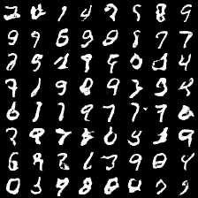

# NS-GAN trained on MNIST
Basically a "hello world" to find out how to use Flux.jl to do AI stuff in Julia.

## How to run:
- Run julia from the root of the project
- Type `] activate .` to activate the project
- Backspace to go out of pkg mode
- `using MnistGAN` (to use the package)
- `MnistGAN.train(30)` (to train for 30 epochs)
> **_NOTE:_**  The first time it will have to precompile and download the dataset, which will take some time and require user input

_Example output image after 30 epochs on default settings_